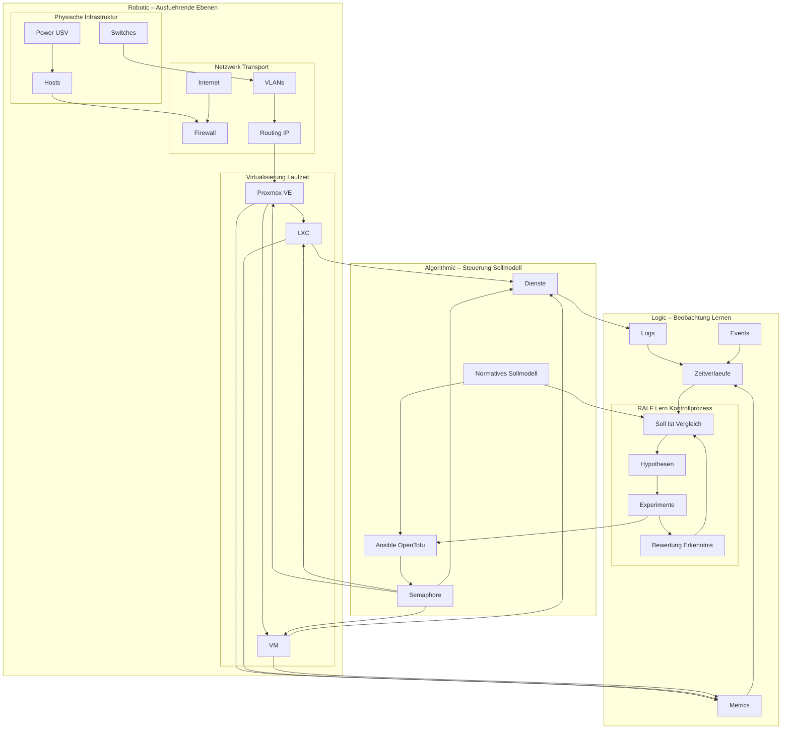

# RALF – Robotic Algorithmic Logic Framework

RALF ist ein **lern- und experimentorientiertes Infrastruktur-Framework**.
Es betrachtet Hardware, Netzwerk, Virtualisierung, Dienste, Automatisierung und
KI-gestützte Analyse **als ein zusammenhängendes System** – nicht als Einzelkomponenten.

Ziel von RALF ist **nicht primär Optimierung**, sondern das **Verstehen von Infrastruktur**
über Zeit, Abweichungen und Experimente hinweg.

---

## Herkunft des Namens

Der Name **RALF** stammt aus der 1980er-Jahre-Serie *Wiz Kids* (Originaltitel: *Whiz Kids*),
die in Deutschland häufig unter dem Titel *Computer Kids* lief.

In der Serie ist **RALF** ein selbstgebauter Computer des Charakters Richie Adler und
steht als Akronym für:

**R**obotic  
**A**lgorithmic  
**L**ogic  
**F**ramework  

Beschrieben wird RALF als ein *64k Homebrew-Computer* mit Sprachsynthese, der analytisch
unterstützt, Muster erkennt und menschliche Entscheidungen ergänzt – nicht ersetzt.

Diese Eigenschaften bilden die konzeptionelle Grundlage des heutigen RALF-Frameworks.

---

## Architekturprinzipien

- Ganzheitliches System (Framework, kein Tool)
- Verlaufsorientiert statt momentbezogen
- Normatives Referenzmodell („So sollte es sein“)
- Fehler als Lern- und Datenquelle
- Observability vor Autonomie
- Erklärbare Entscheidungen statt Black Box

---

## Ebenenmodell (Überblick)

RALF ist in logisch getrennte Ebenen gegliedert:

- **Robotic**: Physische Ausführung (Hardware, Netzwerk, Laufzeit)
- **Algorithmic**: Steuerung, Automatisierung, Soll-Modelle
- **Logic**: Beobachtung, Analyse, Lernen
- **Framework**: Die Gesamtheit aller Ebenen und Regeln

---

## Offizielles Architekturdiagramm

Das folgende Diagramm ist **Mermaid-ready** und wird von GitHub automatisch gerendert,
sofern Mermaid-Unterstützung aktiv ist.

Interpretation des Diagramms
Bottom-up: Realität → Metriken → Verläufe

Top-down: Soll-Modell → Automatisierung → Ausführung

RALF vergleicht Ideal und Realität, formuliert Hypothesen und
stößt kontrollierte Experimente an

Keine direkte Aktion ohne Automatisierungsschicht

Status
RALF ist ein lebendes Forschungs- und Lernprojekt.
Autonomie ist kein Zielzustand, sondern ein Untersuchungsgegenstand.
