RALF: Ein selbst‑orchestrierendes Homelab als Forschungsplattform für LXC‑zentrierte Infrastruktur und KI‑gestützte Betriebsführung
Zusammenfassung (Abstract)

Dieses Dokument beschreibt RALF, ein experimentelles, selbst‑orchestrierendes Homelab‑System, das als Forschungs‑ und Lernplattform für moderne Infrastrukturautomatisierung, Betriebsführung (Operations) und KI‑gestützte Entscheidungsprozesse dient. RALF verbindet klassische Virtualisierung auf Basis von Proxmox mit einem strikt LXC‑orientierten Betriebsmodell, deklarativen Konfigurationsansätzen (Ansible, OpenTofu) und einer geplanten KI‑Kontrollinstanz, die Infrastrukturzustände beobachten, bewerten und Handlungsvorschläge ableiten soll. Im Gegensatz zu produktiven Cloud‑ oder Kubernetes‑Umgebungen liegt der Fokus bewusst auf Transparenz, Nachvollziehbarkeit und deterministischem Verhalten. Dieses Paper dokumentiert den aktuellen Stand der Umsetzung, die zugrunde liegenden Designentscheidungen sowie die mittelfristige Weiterentwicklung.

Schlüsselbegriffe

Homelab, Infrastruktur als Code, LXC, Proxmox, Orchestrierung, Observability, KI‑gestützte Operations, erklärbare Automatisierung

1. Einleitung

Homelabs haben sich in den letzten Jahren von einfachen Spielwiesen für einzelne Dienste zu komplexen, hochgradig automatisierten Systemen entwickelt. Sie werden zunehmend genutzt, um reale Produktionsszenarien im Kleinen abzubilden, neue Technologien zu evaluieren und Betriebsprozesse zu verstehen. RALF ist aus genau diesem Anspruch heraus entstanden: nicht als Produktivsystem, sondern als experimentelle Infrastruktur, die bewusst überschaubar bleibt und dennoch reale Komplexität zulässt.

Ein zentrales Ziel von RALF ist es, Infrastruktur nicht nur zu betreiben, sondern sie als System zu begreifen, das beobachtet, beschrieben und schrittweise automatisiert werden kann. Dabei wird bewusst auf gängige Abstraktionen wie Docker oder Kubernetes verzichtet, um ein tieferes Verständnis der zugrunde liegenden Mechanismen zu ermöglichen. RALF soll nicht „magisch“ funktionieren, sondern erklärbar bleiben – auch dann, wenn künftig KI‑basierte Komponenten integriert werden.

2. Zielsetzung und Leitprinzipien

Die Entwicklung von RALF folgt mehreren klar definierten Leitlinien:

Erstens wird ein LXC‑first‑Ansatz verfolgt. Alle Dienste werden als LXC‑Container oder – in begründeten Ausnahmefällen – als virtuelle Maschinen betrieben. Container‑Engines wie Docker werden bewusst ausgeschlossen, da sie zusätzliche Abstraktionsschichten einführen, die Fehlersuche und Lernprozesse erschweren können.

Zweitens existiert eine deklarative Single Source of Truth. Netzwerke, Hosts, Container, Dienste und deren Beziehungen werden in strukturierten Dateien beschrieben. Diese Beschreibungen sind verbindlich und bilden die Grundlage für jede Automatisierung.

Drittens wird Netzwerk‑Determinismus als nicht verhandelbare Voraussetzung betrachtet. Feste IP‑Adressbereiche, klar definierte Rollen und Segmentierungen sind essenziell, um Automatisierung reproduzierbar und analysierbar zu machen.

Viertens gilt der Grundsatz Observability vor Autonomie. Bevor Systeme eigenständig Entscheidungen treffen dürfen, müssen sie messbar, nachvollziehbar und für Menschen verständlich sein.

3. Hardware‑ und physische Ebene

Die physische Infrastruktur von RALF besteht aus mehreren Servern mit unterschiedlichen CPU‑Generationen und Leistungsprofilen. Ziel ist nicht Homogenität, sondern das bewusste Arbeiten mit realistischen Unterschieden in Rechenleistung, Energieeffizienz und I/O‑Fähigkeiten. Ergänzt wird das Setup durch eine separate Workstation, die sowohl als Arbeits‑ als auch als Testsystem dient.

Die Netzwerkhardware basiert auf gemanagten Switches mit VLAN‑Unterstützung. Als zentrales Gateway fungiert eine Firewall‑Appliance, die Routing, Segmentierung und externe Anbindung übernimmt. Diese physische Basis ist bewusst stabil gehalten, da sie als Fundament für alle darüberliegenden Experimente dient.

4. Virtualisierung und Laufzeitumgebung

Auf der Virtualisierungsebene kommt Proxmox VE als Hypervisor zum Einsatz. Proxmox bietet eine transparente Verwaltung von LXC‑Containern und virtuellen Maschinen und eignet sich daher besonders gut für ein erklärbares Homelab‑Design.

Jeder LXC‑Container erhält:

eine eindeutige Container‑ID

eine feste IP‑Adresse

eine klar definierte funktionale Rolle

Diese Eigenschaften werden nicht dynamisch vergeben, sondern deklarativ festgelegt. Virtuelle Maschinen werden nur dort eingesetzt, wo LXC technisch oder sicherheitstechnisch nicht ausreicht.

5. Netzwerkarchitektur

Die Netzwerkarchitektur von RALF ist als Baseline definiert und gilt als unveränderliche Voraussetzung für alle Deployments. Sie umfasst eine klare Trennung zwischen Edge‑Netz, Management‑Netz und Service‑Segmenten.

Ein zentrales Ziel ist es, Netzwerkverhalten vorhersehbar zu machen. Dienste sollen nicht „irgendwo“ erreichbar sein, sondern immer an definierten Adresspunkten. Diese Vorhersehbarkeit ist entscheidend für Automatisierung, Monitoring und spätere KI‑gestützte Analysen.

6. Aktueller Service‑Stand

Der aktuelle Service‑Stack umfasst eine Vielzahl klassischer Infrastruktur‑ und Anwendungsdienste. Dazu gehören Datenbanken, Verwaltungsoberflächen, Versionsverwaltung, Passwort‑Management und Mail‑Dienste. Jeder Dienst wird als eigener Eintrag mit Metadaten, Abhängigkeiten und Betriebsparametern geführt.

Diese Service‑Beschreibungen dienen nicht nur der Dokumentation, sondern bilden die Grundlage für automatisierte Deployments, Prüfungen und zukünftige Entscheidungslogik.

7. Automatisierung und Kontrolllogik
7.1 Klassische Automatisierung

Die Basis der Automatisierung bilden bewährte Werkzeuge:

Ansible wird für Konfigurationsmanagement und idempotente Zustandsdurchsetzung genutzt. OpenTofu dient der deklarativen Planung von Infrastruktur. Semaphore UI fungiert als kontrollierte Ausführungs‑ und Audit‑Schicht, um Automatisierung reproduzierbar und nachvollziehbar zu halten.

7.2 Das RALF‑Konzept als KI‑Ebene

RALF selbst ist aktuell weniger ein einzelnes Programm als ein konzeptionelles Kontrollmodell. Langfristig soll RALF folgende Fähigkeiten besitzen:

Erstens die kontinuierliche Beobachtung von Systemzuständen über Metriken, Logs und Inventardaten. Zweitens die Bewertung dieser Zustände anhand definierter Regeln und Modelle. Drittens die Ableitung von Handlungsvorschlägen oder – unter klaren Einschränkungen – automatisierten Aktionen. Viertens das Lernen aus Ergebnissen, um zukünftige Entscheidungen zu verbessern.

Wichtig ist dabei, dass RALF nicht als autonomer „Black Box“-Agent verstanden wird, sondern als erklärbares Entscheidungswerkzeug.

8. Beobachtbarkeit und Feedback

Observability ist ein zentrales Element von RALF. Metriken werden gesammelt und in Dashboards visualisiert, die primär für Menschen lesbar sind. Ziel ist nicht maximale Alarmierung, sondern Verständnis: Warum verhält sich ein System so, wie es sich verhält?

Diese Daten bilden später die empirische Grundlage für jede Form von KI‑gestützter Orchestrierung.

9. Sicherheitsaspekte

Sicherheit wird in RALF pragmatisch betrachtet. Externe Zugriffe werden auf ein Minimum reduziert und zeitlich begrenzt. Management‑Zugänge sind klar getrennt von Anwendungsdiensten. Geheimnisse und Zugangsdaten werden nicht in Klartext‑Automatisierungen abgelegt.

10. Roadmap und Weiterentwicklung

Die Weiterentwicklung von RALF ist bewusst iterativ geplant. Kurz‑ bis mittelfristig stehen der Ausbau des Service‑Katalogs, die formale Beschreibung von Service‑Abhängigkeiten und die Verbesserung der Observability im Fokus.

Langfristig soll RALF in der Lage sein, selbstständig Hypothesen über Systemzustände zu formulieren, diese zu prüfen und dem Menschen verständlich zu präsentieren.

11. Formale Definition von RALF: Systemmodell, Rollen und Ebenen
11.1 Begriffliche Einordnung

RALF ist als ganzheitliches System zu verstehen. Es handelt sich weder um eine einzelne Software‑Komponente noch um eine isolierte KI‑Instanz, sondern um ein Framework, das Hardware, Netzwerk, Virtualisierung, Dienste, Automatisierung und KI‑Logik zu einem kohärenten Gesamtsystem verbindet.

RALF dient primär dazu, bewusst zu lernen und zu experimentieren. Es ist kein Optimierungswerkzeug im klassischen Sinne, sondern eine Infrastruktur, die gezielt so gestaltet ist, dass sie Erkenntnisse über sich selbst hervorbringt.

Formal lässt sich RALF als integriertes infrastrukturelles Meta‑Framework definieren, das den Betrieb, die Beobachtung und die Weiterentwicklung eines Homelabs in einem konsistenten Modell vereint. Einzelne Technologien sind Bestandteile dieses Frameworks, nicht jedoch RALF selbst.

11.2 Zeitliches Systemverständnis

RALF ist verlaufsorientiert konzipiert. Nicht der momentane Zustand allein ist entscheidend, sondern die zeitliche Entwicklung von Zuständen, Entscheidungen und deren Folgen. Ereignisse, Änderungen und Fehler werden als Sequenzen betrachtet, aus denen sich Muster, Korrelationen und Hypothesen ableiten lassen.

Diese zeitliche Perspektive ist Voraussetzung dafür, Infrastruktur nicht nur zu betreiben, sondern systematisch zu verstehen.

11.3 Normatives Referenzmodell

RALF arbeitet nicht ausschließlich deskriptiv („So ist es“), sondern normativ („So sollte es sein“). Die deklarativen Beschreibungen bilden ein Idealmodell, an dem der beobachtete Ist‑Zustand gemessen wird.

Abweichungen zwischen Ideal‑ und Realzustand werden nicht automatisch als Fehler behandelt, sondern als Untersuchungsgegenstand. Genau diese Differenz ist der Ausgangspunkt für Lernen und Experimentieren.

11.4 Fehlerverständnis

Fehler sind in RALF kein rein negatives Ereignis, sondern eine Datenquelle. Sie werden gesammelt, klassifiziert und im zeitlichen Kontext analysiert. Ziel ist nicht primär Fehlervermeidung, sondern Fehlerverständnis.

Dieses Verständnis bildet die Grundlage für spätere Regelbildung, Automatisierung und mögliche autonome Entscheidungen.

11.5 Ebenenmodell

Das RALF‑Framework gliedert sich in vier logisch getrennte Ebenen:

Die physische Ebene umfasst Hardware, Netzwerkkomponenten und Energieversorgung und definiert die Randbedingungen des Systems.

Die Laufzeit‑ und Virtualisierungsebene stellt ausführbare Ressourcen bereit, trifft jedoch selbst keine Entscheidungen.

Die deklarative Modelle‑Ebene beschreibt das Soll‑System in Form von Konfigurationen, Service‑Definitionen und Abhängigkeiten.

Die experimentelle Kontroll‑Ebene (RALF) beobachtet, vergleicht, bewertet und formuliert Hypothesen über das Systemverhalten.

11.6 Rollenverteilung

Der Mensch bleibt integraler Bestandteil des Frameworks. Er definiert Ziele, bewertet Hypothesen und entscheidet über die Konsequenzen von Experimenten. Klassische Automatisierung setzt deterministisch um, was definiert wurde. RALF verbindet beide Rollen, indem es Beobachtung und Interpretation strukturiert.

11.7 Autonomie als Forschungsthema

Autonomie ist in RALF kein Zielzustand, sondern ein Untersuchungsgegenstand. Jede Stufe von Autonomie wird bewusst eingeführt, beobachtet und bewertet. Autonomie ohne Verständnis gilt explizit als unerwünscht.

12. Namensgebung und kultureller Ursprung
12.1 Herkunft des Namens RALF

Der Name RALF ist bewusst gewählt und besitzt sowohl einen persönlichen als auch einen technischen Ursprung. Er geht zurück auf den Computer RALF aus der 1980er‑Jahre‑Fernsehserie Wiz Kids (Originaltitel: Whiz Kids), die in der deutschen Synchronisation häufig unter dem Titel Computer Kids ausgestrahlt wurde.

In der Serie ist RALF kein zufälliger Eigenname, sondern ein Akronym für Robotic Algorithmic Logic Framework. Diese Bezeichnung beschreibt bereits im damaligen Kontext ein System, das Logik, Algorithmen und maschinelle Entscheidungsunterstützung miteinander verbindet.

Der Computer RALF wurde in der Handlung vom Hauptcharakter Richie Adler selbst gebaut und als ein „64k Homebrew‑Computer“ beschrieben. Er verfügt über eine Sprachsynthese‑Einheit und fungiert in der Serie als analytischer Helfer: nicht allwissend, aber außergewöhnlich leistungsfähig im Erkennen von Mustern, im Verknüpfen von Informationen und im Unterstützen menschlicher Entscheidungen.

Diese Darstellung prägte maßgeblich das heutige Verständnis von RALF als System. Die Wahl des Namens ist damit nicht nostalgisch, sondern konzeptionell: RALF steht für ein bewusst konstruiertes, erklärbares und lernfähiges Framework, das dem Menschen assistiert, statt ihn zu ersetzen.

12.2 Bedeutung für das Systemverständnis

Die Namenswahl ist kein rein emotionales Detail, sondern beeinflusst das Systemverständnis fundamental. RALF wird nicht als anonyme Infrastruktur betrachtet, sondern als kohärente Systemidentität, die Technik, Logik und Lernfähigkeit vereint. Diese Identität erleichtert die mentale Modellbildung und unterstützt den Anspruch, Infrastruktur nicht nur zu betreiben, sondern zu verstehen. RALF ist nicht als abstrakter Prozess gedacht, sondern als kohärente, wiedererkennbare Systemidentität. Dies erleichtert die mentale Modellbildung, insbesondere bei der Betrachtung komplexer Wechselwirkungen zwischen Infrastruktur, Automatisierung und Entscheidungslogik.

13. Diagramm‑fähige Systembeschreibung von RALF
13.1 Überblick

Das RALF‑Framework lässt sich als mehrschichtiges System mit gerichteten Abhängigkeiten darstellen. Jede Ebene erfüllt eine klar definierte Funktion und kommuniziert nur über wohldefinierte Schnittstellen mit benachbarten Ebenen.

13.2 Ebenenbeschreibung (von unten nach oben)

Ebene 1 – Physische Infrastruktur
Diese Ebene umfasst Serverhardware, Netzwerkswitche, Verkabelung, Stromversorgung und physische Topologie. Sie stellt die unveränderlichen Randbedingungen dar. In einem Diagramm bildet sie die unterste Schicht.

Ebene 2 – Netzwerk‑ und Transportebene
Hier befinden sich Routing, Segmentierung, Firewalls, IP‑Adressierung und grundlegende Erreichbarkeit. Diese Ebene abstrahiert physische Verbindungen in logische Kommunikationspfade.

Ebene 3 – Virtualisierung und Laufzeit
Diese Ebene umfasst den Hypervisor, LXC‑Container und virtuelle Maschinen. Sie stellt isolierte, ausführbare Umgebungen bereit, besitzt jedoch keine eigene Entscheidungslogik.

Ebene 4 – Dienste und Workloads
Auf dieser Ebene laufen konkrete Anwendungen und Infrastruktur‑Services wie Datenbanken, Verwaltungsoberflächen oder Applikationen. Abhängigkeiten zwischen Diensten sind explizit modelliert.

Ebene 5 – Deklaratives Referenzmodell (Soll‑Zustand)
Diese Ebene beschreibt, wie das System sein sollte. Sie besteht aus Konfigurationsdateien, Service‑Definitionen, Abhängigkeitsgraphen und Policies. In Diagrammen fungiert sie als Referenz‑Overlay über den operativen Ebenen.

Ebene 6 – Beobachtungs‑ und Datenebene
Metriken, Logs, Ereignisse und Zustandsverläufe werden hier gesammelt. Diese Ebene liefert die empirische Grundlage für Analyse und Lernen.

Ebene 7 – Experimentelle Kontroll‑ und Lernschicht (RALF)
Diese oberste Ebene vergleicht Soll‑ und Ist‑Zustände, erkennt Abweichungen, formuliert Hypothesen und bewertet Systemverhalten über die Zeit. Sie greift nicht direkt in die unteren Ebenen ein, sondern wirkt über definierte Schnittstellen und Automatisierung.

13.3 Informationsflüsse

In einem Architekturdiagramm verlaufen Informationsflüsse überwiegend von unten nach oben (Beobachtung) und von oben nach unten (Vorgaben und Experimente). Direkte Querkommunikation zwischen nicht benachbarten Ebenen ist bewusst ausgeschlossen.

13.4 Diagrammhinweis

Dieses Ebenenmodell kann direkt als gestapeltes Schichtdiagramm dargestellt werden. Jede Ebene bildet einen horizontalen Block; RALF selbst ist die oberste Schicht, nicht ein seitlich angebrachtes Zusatzmodul.

13.5 Offizielles Architekturdiagramm in Textform (Mermaid)

```mermaid
flowchart TB
  %% =========================
  %% RALF – Architektur- & Lernmodell
  %% =========================

  %% ---------- Robotic ----------
  subgraph R["Robotic – Ausfuehrende Ebenen"]
    subgraph L1["Physische Infrastruktur"]
      HW["Hosts"]
      SW["Switches"]
      PWR["Power USV"]
    end

    subgraph L2["Netzwerk Transport"]
      EDGE["Internet"]
      FW["Firewall"]
      VLAN["VLANs"]
      IP["Routing IP"]
    end

    subgraph L3["Virtualisierung Laufzeit"]
      PVE["Proxmox VE"]
      LXC["LXC"]
      VM["VM"]
    end
  end

  %% ---------- Algorithmic ----------
  subgraph A["Algorithmic – Steuerung Sollmodell"]
    YAML["Normatives Sollmodell"]
    IAC["Ansible OpenTofu"]
    SEM["Semaphore"]
    SVC["Dienste"]
  end

  %% ---------- Logic ----------
  subgraph L["Logic – Beobachtung Lernen"]
    MET["Metrics"]
    LOG["Logs"]
    EVT["Events"]
    TLINE["Zeitverlaeufe"]

    subgraph RALF["RALF Lern Kontrollprozess"]
      COMP["Soll Ist Vergleich"]
      HYP["Hypothesen"]
      EXP["Experimente"]
      EVAL["Bewertung Erkenntnis"]
    end
  end

  %% =========================
  %% Ausfuehrungspfad
  %% =========================
  PWR --> HW
  HW --> FW
  SW --> VLAN
  EDGE --> FW
  VLAN --> IP --> PVE
  PVE --> LXC --> SVC
  PVE --> VM --> SVC

  %% =========================
  %% Soll zu Umsetzung
  %% =========================
  YAML --> IAC --> SEM
  SEM --> PVE
  SEM --> LXC
  SEM --> VM
  SEM --> SVC

  %% =========================
  %% Beobachtung
  %% =========================
  PVE --> MET
  LXC --> MET
  VM --> MET
  SVC --> LOG
  MET --> TLINE
  LOG --> TLINE
  EVT --> TLINE

  %% =========================
  %% Lernen Experimente
  %% =========================
  YAML --> COMP
  TLINE --> COMP
  COMP --> HYP --> EXP --> IAC
  EXP --> EVAL --> COMP
```

14. Diskussion

RALF bewegt sich bewusst zwischen Hobby‑Projekt und Forschungsprototyp. Sein Mehrwert liegt nicht in maximaler Effizienz, sondern in der Möglichkeit, Infrastruktur als lernbares System zu betrachten. Gerade diese bewusste Begrenzung macht RALF zu einer geeigneten Plattform für Experimente mit erklärbarer Automatisierung.

12. Fazit

RALF zeigt, dass ein Homelab mehr sein kann als eine Sammlung von Diensten. Durch klare Prinzipien, deklarative Beschreibungen und schrittweise Automatisierung entsteht ein System, das sich analysieren, erklären und weiterentwickeln lässt. Die eigentliche Stärke von RALF liegt nicht im aktuellen Funktionsumfang, sondern in seiner Struktur und seinem Erkenntnispotenzial.

Annahmen und offene Punkte

Dieses Dokument geht davon aus, dass der LXC‑zentrierte Ansatz beibehalten wird und Proxmox die Virtualisierungsbasis bleibt. Offene Fragen betreffen vor allem die formale Modellierung von Entscheidungslogik, Kriterien für autonome Aktionen und mögliche Evaluationsmethoden.

## Offizielles Architekturdiagramm

